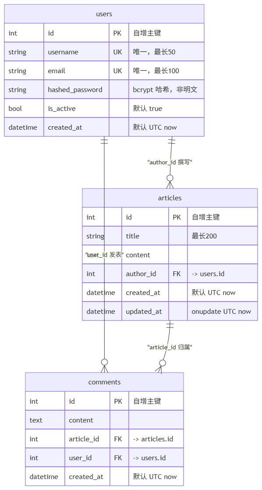
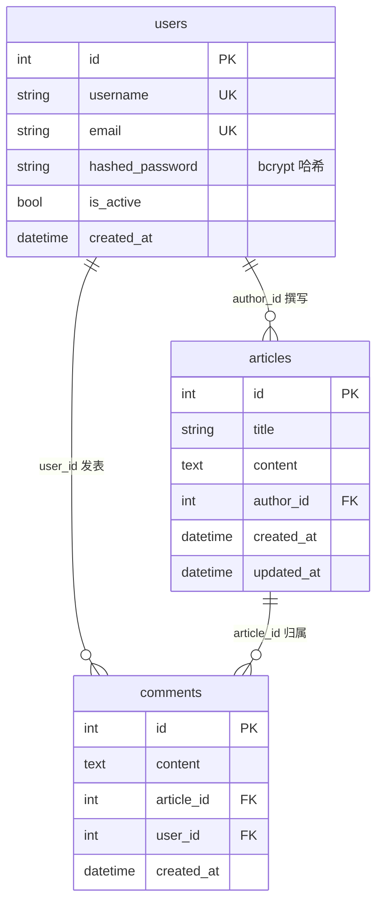

# Blog System Under Test

一个用于测试练习的极简博客系统后端（测试靶场），基于 FastAPI 实现用户认证、文章 CRUD、评论与资源归属权限校验，附带一个零构建的极简前端页面。

## 项目简介

- **核心功能**：注册 / 登录（JWT 鉴权）、文章增删改查、文章评论、资源归属权限校验。
- **密码安全**：明文密码经 bcrypt 加盐哈希后存入 `hashed_password` 字段，不保存明文。
- **权限模型**：受保护接口未携带有效 Token 返回 401；资源不存在返回 404；存在但非本人返回 403。校验顺序固定为 401 → 404 → 403。
  - 修改 / 删除文章仅限作者本人。
  - 删除评论仅限评论者本人，且 `article_id` 参与归属校验，跨文章删除返回 404。
  - 禁用账号（`is_active=false`）登录或携带旧 Token 访问受保护接口返回 403。
- **Swagger 兼容**：登录同时提供 JSON Body 与 Form Data 两种入口，Form 端点专供 Swagger UI 的 Authorize 按钮使用。
- **极简前端**：访问 `/ui` 是纯 HTML + 原生 fetch 的演示页面，Token 存于浏览器 localStorage。

## 技术栈

| 层面 | 技术 | 说明 |
|------|------|------|
| Web 框架 | FastAPI 0.104.1 | 自动生成 OpenAPI / Swagger 文档 |
| ASGI 服务器 | Uvicorn 0.24.0 | 本地开发热重载 |
| ORM | SQLAlchemy 2.0.52 | 声明式模型（`DeclarativeBase`） |
| 数据库 | SQLite | 单文件 `blog.db`，零配置 |
| 数据校验 | Pydantic v2 | 请求 / 响应 Schema，`from_attributes` 兼容 ORM |
| 认证 | python-jose + passlib[bcrypt] | JWT HS256 签名，有效期默认 30 分钟，可由 `ACCESS_TOKEN_EXPIRE_MINUTES` 配置 |
| 模板 | Jinja2 3.1.2 | 渲染 `/ui` 页面 |

运行环境：Python 3.13（3.10+ 均可）。

## 启动命令

```bash
# 1. 安装依赖
pip install -r requirements.txt

# 2. 配置环境变量（首次运行必做，否则启动即报 RuntimeError）
#    Windows PowerShell:
Copy-Item .env.example .env
#    然后编辑 .env，把 SECRET_KEY 换成真实随机值

# 3. 必须在项目根目录启动（templates/ 与 static/ 按相对路径解析）
uvicorn app.main:app --reload
```

启动后：

| 入口 | 地址 |
|------|------|
| API 服务 | http://127.0.0.1:8000 |
| Swagger 文档 | http://127.0.0.1:8000/docs |
| 演示页面 | http://127.0.0.1:8000/ui |

`blog.db` 在首次启动时由 `Base.metadata.create_all()` 自动创建，无需手动建表。

> 注意：`SECRET_KEY` 与 `ACCESS_TOKEN_EXPIRE_MINUTES` 通过根目录 `.env` 注入（`python-dotenv` 加载）。启动时读不到 `SECRET_KEY` 会直接 `RuntimeError` 拒绝启动。克隆仓库后请先复制 `.env.example` 为 `.env` 并填入真实密钥：`python -c "import secrets; print(secrets.token_urlsafe(32))"`。`.env` 已被 `.gitignore` 忽略，切勿入库。

## 接口清单

### 认证

| 方法 | 路径 | 说明 | 鉴权 |
|------|------|------|------|
| POST | `/auth/register` | 注册，body 为 `username` / `email`（需合法邮箱格式）/ `password`，成功返回 201；用户名或邮箱已存在返回 400 | 否 |
| POST | `/auth/login` | 登录，JSON Body，返回 `access_token` 与 `token_type` | 否 |
| POST | `/auth/login/form` | 登录，`application/x-www-form-urlencoded`，专供 Swagger Authorize | 否 |

调用受保护接口时，请求头带 `Authorization: Bearer <access_token>`。

### 文章

| 方法 | 路径 | 说明 | 鉴权 |
|------|------|------|------|
| POST | `/articles` | 创建文章，`author_id` 取自当前登录用户 | 是 |
| GET | `/articles` | 列表，查询参数 `skip`（≥0）、`limit`（1–100，默认 10）、`search`（标题模糊匹配） | 否 |
| GET | `/articles/{article_id}` | 文章详情 | 否 |
| PUT | `/articles/{article_id}` | 更新，传空字段即不改动（`exclude_unset`），仅作者 | 是 |
| DELETE | `/articles/{article_id}` | 删除，仅作者，成功返回 204 | 是 |

### 评论

| 方法 | 路径 | 说明 | 鉴权 |
|------|------|------|------|
| POST | `/articles/{article_id}/comments` | 新增评论，文章不存在返回 404 | 是 |
| GET | `/articles/{article_id}/comments` | 该文章的评论列表 | 否 |
| DELETE | `/articles/{article_id}/comments/{comment_id}` | 删除评论，仅评论者，成功返回 204 | 是 |

### 页面与探测

| 方法 | 路径 | 说明 |
|------|------|------|
| GET | `/` | 服务健康检查，返回提示 JSON |
| GET | `/ui` | 极简前端演示页 |
| GET | `/docs` | Swagger UI |
| GET | `/openapi.json` | OpenAPI Schema |

## 数据模型





- **users 1 : N articles** — `articles.author_id` → `users.id`，非空。
- **users 1 : N comments** — `comments.user_id` → `users.id`，非空。
- **articles 1 : N comments** — `comments.article_id` → `articles.id`，非空。

三个外键均为 `NOT NULL`，删除用户或文章不会级联清理关联数据（SQLite 默认未开启外键约束），需要自行处理孤儿记录。

## 目录结构

```
blog-system-under-test/
├── app/
│   ├── main.py              # 应用入口：路由注册、模板与静态挂载
│   ├── database.py          # engine / SessionLocal / get_db 依赖
│   ├── models.py            # User / Article / Comment ORM 模型
│   ├── schemas.py           # Pydantic 请求与响应模型
│   ├── auth.py              # 密码哈希、JWT 签发校验、get_current_user
│   └── routers/
│       ├── auth.py          # /auth/login、/auth/login/form
│       ├── users.py         # /auth/register
│       ├── articles.py      # 文章 CRUD
│       └── comments.py      # 评论接口
├── templates/index.html     # /ui 演示页
├── static/                  # 静态资源挂载点（当前为空，含 .gitkeep 占位）
├── er-diagram.png           # ER 图（由 Mermaid 经 draw.io 导出）
├── .env.example             # 环境变量模板（复制为 .env 后使用）
├── requirements.txt
├── interview_notes.md       # 逐日开发复盘
└── README.md

```


